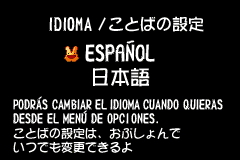
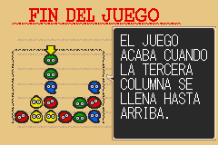
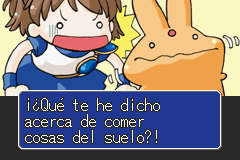
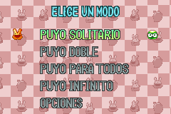
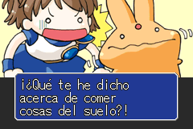
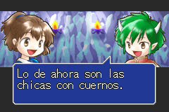

Puyo Pop (GBA) — Traducción al Español v1.1

Este parche traduce completamente al español el videojuego Puyo Pop (conocido en Japón como Minna de Puyo Puyo) para la Game Boy Advance, permitiendo disfrutar de la entrega clásica de puzles en nuestro idioma.

Instrucciones de aplicación

ROM base necesaria: Puyo Pop (USA) (descomprimida en formato .gba).

Utiliza una herramienta de parcheo como Floating IPS (Flips) o un aplicador en línea (como Romhacking.net Patcher).

Selecciona la ROM original, el archivo del parche .bps y aplica los cambios para generar la ROM traducida.

Screenshots:

